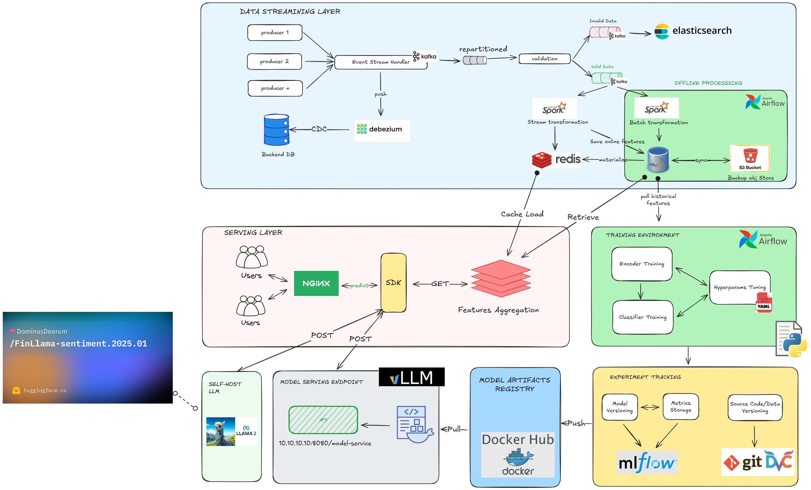

# Transaction Classification Pipeline

## Repo Overview

This repository contains an **end-to-end transaction classification engine**:

- **Offline pipeline (MLOps)** to generate synthetic data, train encoders, build feature stores and train a tri-tower classifier.
- **Online/demo web app (`webapp/`)** built with FastAPI that exposes the trained model via:
  - A REST API (`/classify`, `/options`, `/health`).
  - A small HTML frontend for interactive experimentation.

The webapp reuses the artifacts produced by the offline pipeline (encoders, embeddings, label map, classifier checkpoint).

## Repository Structure

- `data/` – raw data, processed embeddings and feature store parquet files.
- `models/` – trained encoders and tri-tower classifier checkpoints.
- `src/` – training and preprocessing code for encoders, features and classifier.
- `docs/` – diagrams and documentation (including the MLOps pipeline figure).
- `webapp/` – FastAPI-based demo and inference service on top of the trained model.
- `tests/` – tests for the training/inference components.
- `logs/`, `reports/` – logging and reporting outputs.
- `Makefile`, `Makefile.linux` – orchestrate the end-to-end pipeline.

See `data/DATA_FLOW.md` for a detailed walkthrough of the data flow and training steps, and `webapp/README.md` for webapp-specific details.

## Overview of End-to-End MLOps Pipeline

[](docs/TRANX_ENGINE_OPS.png)

## Quick Start

```bash
# Install GNU Make for Windows (if not installed)
# Download from: http://gnuwin32.sourceforge.net/packages/make.htm

# Run complete training pipeline
make pipeline-train

# See all commands
make help
```

## Prerequisites

1. **Install Dependencies**

   ```bash
   pip install pandas numpy torch scikit-learn scipy joblib fasttext-wheel tqdm
   ```

2. **Download FastText Model**
   - Place `cc.vi.300.bin` in `models/` directory
   - Download: <https://fasttext.cc/docs/en/crawl-vectors.html>

## Make Commands

### Complete Pipelines

```bash
make pipeline-train              # Full pipeline: data → encoders → features → classifier
make generate-data               # Generate synthetic data only
```

### Training Steps

```bash
make train-encoders              # Train context + sender encoders
make train-ctx-encoder           # Train context encoder only
make train-snd-encoder           # Train sender encoder only
make train-classifier            # Train tri-tower classifier
```

### Feature Building

```bash
make build-features-train        # Build all training features (includes labels)
make build-features-inference    # Build inference features (no labels)
make build-ctx-emb-train         # Context embeddings (training mode)
make build-ctx-emb-inference     # Context embeddings (inference mode)
make build-snd-features          # Sender features
make build-rcv-features          # Recipient features
```

### Utilities

```bash
make check-data                  # Check if data files exist
make check-models                # Check if models exist
make clean                       # Remove features/models (keep raw data)
make clean-all                   # Remove everything
```

## Pipeline Flow

```text
1. DATA → 2. ENCODERS → 3. FEATURES → 4. CLASSIFIER

generate-data
├── transactions_landing.parquet
├── recipient_entity.parquet
├── merchant_profile.parquet
└── person_profile.parquet
       ↓
train-encoders
├── train-ctx-encoder  → ctx_encoder.pt (128-dim)
└── train-snd-encoder  → snd_encoder.pt (128-dim)
       ↓
build-features-train
├── build-ctx-emb-train  → ctx_emb.parquet
├── build-snd-features   → x_snd/date=*/x_snd_user_state.parquet
└── build-rcv-features   → x_rcv/date=*/x_rcv_entity_state.parquet (96-dim)
       ↓
train-classifier
└── tri_tower_classifier.pt (352-dim input → 10 classes)
```

## Customization

### Modify Hyperparameters

Edit `Makefile` and change the arguments in respective targets:

- **Context Encoder**: `train-ctx-encoder` (--hidden, --emb-dim, --epochs)
- **Sender Encoder**: `train-snd-encoder` (--hidden, --maxlen, --epochs)
- **Classifier**: `train-classifier` (--hidden-dims, --dropout-rates, --epochs)

### Change Data Size

Edit `data/generate_synthetic_data.py`:

```python
NUM_TRANSACTIONS = 10000  # Change this
NUM_USERS = 1000
NUM_ENTITIES = 500
```

## Troubleshooting

**Missing modules**: `pip install <module-name>`

**FastText not found**: Download `cc.vi.300.bin` to `models/`

**Out of memory**: Reduce `--batch-size` in Makefile

**Missing labels in ctx_emb**: Use `make build-ctx-emb-train` not `build-ctx-emb-inference`

## Output Locations

- **Raw Data**: `data/raw/`
- **Features**: `data/feature_store/`
- **Models**: `models/`
- **Embeddings**: `data/processed/`

## Web Demo (FastAPI Webapp)

The `webapp/` folder contains a small FastAPI-based service and HTML frontend that expose the trained classifier through a 3-layer decision pipeline:

1. **Rule layer** – heuristic rules based on transaction type and message keywords.
2. **LLM layer (Gemini)** – optional Google Gemini call that returns a label + confidence.
3. **Model layer (tri-tower classifier)** – uses context + sender + recipient embeddings from the feature store.

The webapp reuses artifacts produced by the training pipeline:

- `data/label_map.json`
- `data/feature_store/x_snd/date=ALL/x_snd_user_state.parquet`
- `data/feature_store/x_rcv/date=ALL/x_rcv_entity_state.parquet`
- `models/tri_tower_classifier.pt` and context encoder artifacts under `models/`

### Running the Web Demo (local)

1. Install dependencies:

   ```bash
   pip install -r requirements.txt
   pip install -r webapp/requirements.txt
   ```

2. Ensure you have run the training pipeline (or otherwise produced the required artifacts above).

3. Optionally set `GEMINI_API_KEY` (for real LLM calls) or `SKIP_GEMINI=1` (offline mode).

4. Start the server from the repo root:

   ```bash
   uvicorn webapp.main:app --reload
   ```

5. Open <http://127.0.0.1:8000/> to use the HTML demo.

For more details, see `webapp/README.md` and `WEBAPP_PLAN.md`.
