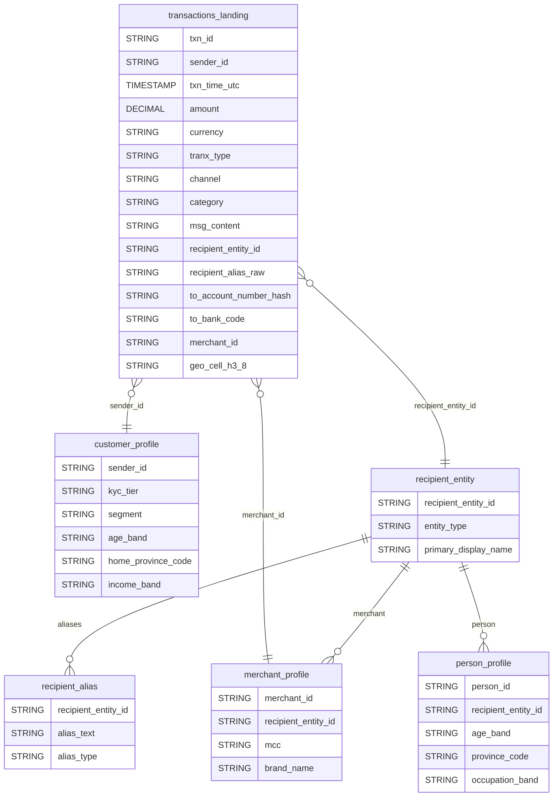
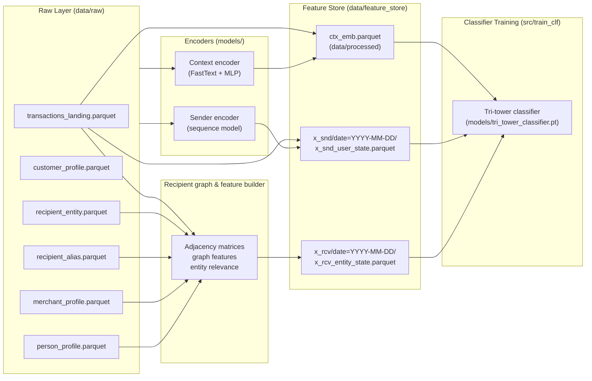
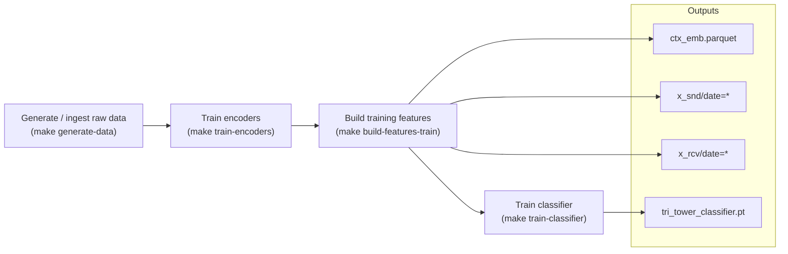
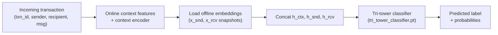
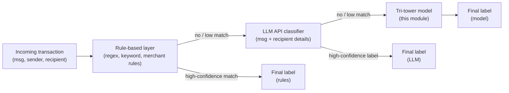
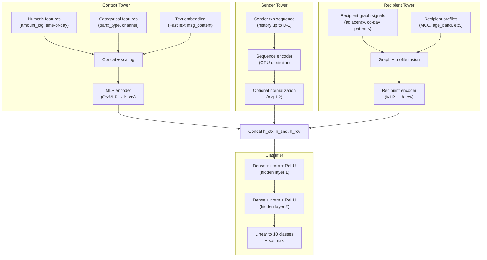

# Transaction Classification Module Breakdown

## 1. Problem Statement

### 1.1 Business Context

The bank’s digital channels (mobile, web, QR, bill pay) generate large volumes of retail transactions. Each transaction is stored with structured fields (amount, time, channel, sender, recipient) and a short, noisy description (Vietnamese free text, merchant strings, user-typed memos).

Many downstream use cases depend on reliable, high-level categories:
- Spending analytics and PFM (personal financial management).
- Customer segmentation and personalization.
- Risk, fraud, and credit decision support.

Manually curated rule sets (keyword lists, merchant lookups) are brittle and hard to maintain. The transaction classification module replaces these with a model-driven system that can generalize to new merchants, aliases, and behaviors.

### 1.2 Technical Formulation

We frame the problem as **multi-class supervised classification**:
- Input for one transaction `t` at time `τ`:
  - **Context features**: attributes of `t` itself (amount, time-of-day, channel, transaction type, free-text memo).
  - **Sender features**: behavioral embedding of the customer (`sender_id`) up to time `τ − Δ` (lookback, usually 1 day).
  - **Recipient features**: behavioral + profile embedding of the recipient entity (`recipient_entity_id`) up to time `τ − Δ`.
- Output:
  - A **10-class label** `y ∈ {BIL, FOO, TRN, HLT, INS, SHP, ENT, EDU, FIN, OTH}` with an associated probability distribution.

The module is trained offline and then used for batch or near-real-time scoring of new transactions.

### 1.3 Key Challenges and Design Choices

- **Noisy Vietnamese text**  
  Memos and merchant strings are short, informal, and often misspelled. We rely on pretrained FastText Vietnamese embeddings plus a learned context encoder to robustly compress textual and tabular context into a dense vector.

- **Long-tail senders and recipients**  
  Many customers and recipients have sparse histories. The design combines:
  - Behavioral encoders (sender and recipient towers) for entities with history.
  - Coarse profile features (age bands, segments, MCC codes, location) for cold-start robustness.

- **Temporal consistency & data leakage**  
  To mirror production, the classifier only sees features built from the **past**. We enforce a 1-day lookback between transaction time and feature snapshots and store features in a **time-partitioned feature store**.

- **Explainability and maintainability**  
  The system is decomposed into clear stages (data → encoders → features → classifier) with explicit data contracts and storage locations. This makes it easier to debug, retrain, and extend.

---

## 2. Data Architecture

### 2.1 Core Tables and Schemas

Raw data is stored as Parquet files under `data/raw/`. Column-level details follow `data/source_data_dictionary.md`; here we list all fields and their roles.

#### 2.1.1 `transactions_landing` (Fact Table)

Central event table; one row per transaction.

| Column                 | Type              | Description                                      |
| ---------------------- | ----------------- | ------------------------------------------------ |
| `txn_id`               | STRING            | Unique transaction id                            |
| `sender_id`            | STRING            | Customer id (FK → `customer_profile.sender_id`)  |
| `txn_time_utc`         | TIMESTAMP         | Event time in UTC                                |
| `amount`               | DECIMAL(18,2)     | Transaction amount                               |
| `currency`             | STRING(3)         | Currency code (ISO 4217)                         |
| `tranx_type`           | ENUM              | App flow type                                    |
| `channel`              | ENUM              | Transaction channel (`MOBILE`, `WEB`)            |
| `category`             | STRING(3)         | Transaction category (raw label)                 |
| `msg_content`          | STRING            | Raw memo / description                           |
| `recipient_entity_id`  | STRING NULL       | Canonical recipient (FK → `recipient_entity`)    |
| `recipient_alias_raw`  | STRING            | Raw payee input (user-entered alias)            |
| `to_account_number_hash` | STRING          | Hashed recipient account                         |
| `to_bank_code`         | STRING            | Recipient bank code                              |
| `merchant_id`          | STRING NULL       | Merchant id if merchant (FK → `merchant_profile`)|
| `geo_cell_h3_8`        | STRING NULL       | Coarse event location (H3 cell)                  |

**Role in pipeline**
- Primary input to:
  - **Context encoder** (builds `ctx_emb_*`).
  - **Sender history** construction.
  - **Recipient history** construction.
  - Supervised training labels (`label_l1`).

#### 2.1.2 `customer_profile` (Sender Dimension)

| Column               | Type   | Description                         |
| -------------------- | ------ | ----------------------------------- |
| `sender_id`          | STRING | Customer id (PK)                    |
| `kyc_tier`           | ENUM   | KYC level (`L0`, `L1`, `L2`, `L3`)  |
| `segment`            | ENUM   | Segment (`student`, `salaried`, `self_employed`, `merchant`, `retired`, `other`) |
| `age_band`           | ENUM   | Age bucket                          |
| `home_province_code` | STRING | Coarse home location                |
| `income_band`        | ENUM   | Income band (`low`, `mid`, `upper_mid`, `high`, `unk`) |

**Role**
- Enriches sender behavior with stable profile features.
- Supports cold-start sender embeddings when behavioral history is short.

#### 2.1.3 `recipient_entity` and `recipient_alias` (Recipient Registry)

**`recipient_entity`**

| Column               | Type   | Description                            |
| -------------------- | ------ | -------------------------------------- |
| `recipient_entity_id`| STRING | Canonical recipient id (PK)            |
| `entity_type`        | ENUM   | `MERCHANT` or `PERSON`                 |
| `primary_display_name` | STRING | Canonical name                        |

**`recipient_alias`**

| Column               | Type   | Description                                      |
| -------------------- | ------ | ------------------------------------------------ |
| `recipient_entity_id`| STRING | FK → `recipient_entity.recipient_entity_id`      |
| `alias_text`         | STRING | Observed alias text                              |
| `alias_type`         | ENUM   | `account_name`, `account_number`, `phone`, `handle` |

**Role**
- Provide **stable recipient IDs** for learning.
- Enable canonicalization from messy payment inputs to entities.

#### 2.1.4 `merchant_profile` and `person_profile` (Recipient Profiles)

**`merchant_profile`**

| Column               | Type      | Description                        |
| -------------------- | --------- | ---------------------------------- |
| `merchant_id`        | STRING    | Merchant id (PK)                   |
| `recipient_entity_id`| STRING    | FK → `recipient_entity`            |
| `mcc`                | STRING(4) | Merchant Category Code             |
| `brand_name`         | STRING    | Public brand name                  |

**`person_profile`**

| Column               | Type   | Description                        |
| -------------------- | ------ | ---------------------------------- |
| `person_id`          | STRING | Person id (PK)                     |
| `recipient_entity_id`| STRING | FK → `recipient_entity`            |
| `age_band`           | ENUM   | Coarse age band                    |
| `province_code`      | STRING | Coarse location                    |
| `occupation_band`    | ENUM   | Occupation band                    |

**Role**
- Provide semantic context for recipients:
  - Merchants: MCC and brand are strong category signals.
  - Persons: age/location/occupation help disambiguate P2P transfers.

### 2.2 Label Taxonomy

Labels are defined in `data/label_map.json` and used consistently throughout the module:

| Code | Name                     | Typical examples (intuitive)        |
| ---- | ------------------------ | ----------------------------------- |
| BIL  | Bills & Utilities        | Electricity, water, internet, rent  |
| FOO  | Food & Drink             | Groceries, restaurants, cafes       |
| TRN  | Transport & Mobility     | Ride-hailing, public transport      |
| HLT  | Health & Wellness        | Clinics, pharmacies, health services|
| INS  | Insurance & Taxes        | Insurance premiums, tax payments    |
| SHP  | Shopping & Retail        | E-commerce, retail stores           |
| ENT  | Entertainment & Leisure  | Streaming, games, cinemas, events   |
| EDU  | Education & Learning     | Tuition, courses, educational svcs  |
| FIN  | Financial Services       | Loans, savings, investments, fees   |
| OTH  | Other                    | Miscellaneous / uncategorized       |

### 2.3 Data Relationships (ER View)

At a high level, the model operates on a star-like schema: transactions at the center, connected to sender and recipient dimensions.

**Join patterns used in the pipeline**
- Sender enrichment: `transactions_landing.sender_id` → `customer_profile.sender_id`.
- Recipient enrichment: `transactions_landing.recipient_entity_id` → `recipient_entity.recipient_entity_id`.
- Merchant enrichment (conditional): `transactions_landing.merchant_id` → `merchant_profile.merchant_id`.
- Person enrichment (conditional): `recipient_entity.recipient_entity_id` → `person_profile.recipient_entity_id`.

### 2.4 Data Flow & Storage Layout

From raw tables to model-ready features, the pipeline follows this data lineage:

**Storage conventions (current local version)**
- **Raw data**: `data/raw/*.parquet`.
- **Processed context embeddings**: `data/processed/ctx_emb.parquet`.
- **Sender feature store**: `data/feature_store/x_snd/date=*`.
- **Recipient feature store**: `data/feature_store/x_rcv/date=*`.
- **Models & artifacts**: `models/` (encoders, classifier, preprocessors).

### 2.5 Feature Store Architecture (Detailed)

The current feature store is a lightweight **local Parquet layout** that follows production-style patterns:

- **Entities and feature groups**
  - **Sender entity** (`sender_id`):
    - Daily snapshots in `x_snd/date=YYYY-MM-DD/x_snd_user_state.parquet`.
    - Each row: `sender_id`, `snd_emb_*`, plus optional activity metadata (counts, recency).
  - **Recipient entity** (`recipient_entity_id`):
    - Daily snapshots in `x_rcv/date=YYYY-MM-DD/x_rcv_entity_state.parquet`.
    - Each row: `recipient_canon_id` / `recipient_entity_id`, `rcv_emb_*`, plus profile-like attributes.
  - **Transaction entity** (`txn_id`):
    - One-off context embeddings in `data/processed/ctx_emb.parquet` (`ctx_emb_*`, labels, and minimal metadata in train mode).

- **Partitioning and point-in-time semantics**
  - Snapshots are partitioned by **feature date**, encoded in the folder path: `date=YYYY-MM-DD`.
  - Training computes `_feature_date = txn_date − lookback_days` and joins on:
    - (`sender_id`, `_feature_date`) → sender snapshot.
    - (`recipient_entity_id`, `_feature_date`) → recipient snapshot.
  - This enforces **point-in-time correctness**: a transaction never uses features built from future behavior.

- **Local vs future production-grade store**
  - Today:
    - Simple Parquet files on disk, ideal for experimentation and reproducible offline training.
  - Future evolution:
    - A managed **offline store** (object storage + warehouse) using the same partitioning, to support large-scale training and backfills.
    - A low-latency **online store** (e.g. Redis/Key-Value DB) keyed by `sender_id` / `recipient_entity_id` for real-time scoring.
    - A feature-store layer (or framework such as Feast) to define features once and materialize them consistently across offline and online stores.

This keeps the current implementation minimal while providing a clear migration path to a production-ready feature-store architecture.

---

## 3. Method / Pipeline

### 3.1 Pipeline Overview (Offline & Online)

The end-to-end system has two main flows:
- **Offline training / feature building** driven by `Makefile` targets.
- **Online scoring** that uses offline features together with live transaction context.

#### 3.1.1 Offline training & feature building

Conceptually:
1. **Data preparation** – synthetic generator or upstream ETL creates all six raw tables.
2. **Encoder training** – context encoder (for `ctx_emb_*`) and sender encoder (for `snd_emb_*`) are trained.
3. **Feature building** – context, sender, and recipient features are materialized into the feature store.
4. **Classifier training** – the tri-tower classifier is trained on merged features and labels.

#### 3.1.2 Online scoring (using offline features)

In production:
- The **offline pipeline** keeps `x_snd`, `x_rcv`, and the classifier weights up to date.
- The **online flow** computes fresh `h_ctx` from the live transaction, combines it with the latest `h_snd` and `h_rcv`, and applies the same classifier as used in training.

#### 3.1.3 Desired higher-layer classification stack (rules + LLM + model)

In the desired future state, this module becomes the **third layer** in a wider transaction classification stack:

- **Layer 1 – Rule-based**: fast, interpretable rules over transaction message and merchant strings (e.g. regex/keyword lists, MCC-based rules). If a confident rule fires, the transaction is labeled here.
- **Layer 2 – LLM API**: for transactions not covered by rules, call an external LLM with the message and recipient details (especially merchant info) to predict a category and confidence.
- **Layer 3 – Tri-tower model (this module)**: if both rules and LLM fail to produce a confident label, fall back to the tri-tower classifier, which uses full behavioral and contextual features (`h_ctx`, `h_snd`, `h_rcv`) as described above.

### 3.2 Feature Engineering Strategy (Three Towers)

#### 3.2.1 Context Tower Features

Built directly from `transactions_landing`:
- **Numerical**:
  - `amount_log = log1p(amount)`.
  - Time-of-day signals derived from `txn_time_utc` (e.g. sine/cosine encoding of hour).
- **Categorical**:
  - One-hot or embedding of `tranx_type` and `channel`.
- **Text**:
  - FastText sentence vectors for `msg_content` using `cc.vi.300.bin`.

These signals are concatenated and passed through the **context encoder** to form a compact vector `h_ctx` used by the classifier.

#### 3.2.2 Sender Tower Features

Derived from sequences of transactions for each `sender_id`:
- Construct time-ordered histories of past transactions.
- Feed sequences into a **sequence model** (e.g. GRU) that summarizes behavior into an embedding `h_snd`.
- Materialize embeddings as daily snapshots:
  - `x_snd/date=YYYY-MM-DD/x_snd_user_state.parquet` (point-in-time).
  - `x_snd/date=ALL/x_snd_user_state.parquet` (latest known state).

These features capture stable patterns such as recurring bills, typical ticket sizes, channel preferences, and spending intensity.

#### 3.2.3 Recipient Tower Features

Built at the level of `recipient_entity_id`:
- **Behavioral (collaborative)**:
  - Aggregations over senders who pay a given entity (counts, diversity, frequency).
- **Profile-based**:
  - Merchants: MCC, brand, other merchant profile fields.
  - Persons: age band, province, occupation band from `person_profile`.
- Combined into a recipient embedding `h_rcv` stored as `rcv_emb_*` in `x_rcv` snapshots.

Together, these features let the model recognize that “who you are paying” is often as informative as the text in the memo.

### 3.3 Model Architecture (Tri-Tower)

At inference time, the model combines three specialized towers into a single classifier:

Key properties:
- **Dense representation**: each tower outputs a relatively low-dimensional vector (e.g. 128 for context/sender, ~96 for recipient).
- **Shared classifier**: concatenated embeddings feed a multi-layer perceptron with normalization and dropout.
- **End target**: softmax over 10 classes, optimized via cross-entropy loss.

### 3.4 Temporal Consistency and Feature Store

To avoid leakage and mimic production:
- For a transaction on date `D`, the classifier uses features from **date `D − 1`**:
  - `_feature_date = D − lookback_days`.
  - Sender and recipient embeddings are looked up from `x_snd` and `x_rcv` using `_feature_date`.
- Daily snapshots in the feature store guarantee **point-in-time correctness**.
- A cumulative `date=ALL` partition stores the latest embedding for each entity for online scoring.

---

## 4. Results & Evaluation (Conceptual Metrics)

### 4.1 Metrics Tracked

The classifier trainer tracks:
- **Loss (cross-entropy)**: optimization objective used for training and early stopping.
- **Accuracy**: proportion of transactions where the top-1 predicted label matches the true label.
- **Macro F1**: unweighted average of per-class F1 scores.
- **Multi-class ROC-AUC (macro, one-vs-rest)**: area under the ROC curve averaged across classes using predicted probabilities.

### 4.2 Which metrics matter most

For this problem:
- **Macro F1 is the primary metric** for model selection and monitoring, because it treats all categories equally and handles class imbalance better than accuracy.
- **Macro ROC-AUC (one-vs-rest) is the secondary metric**, useful for assessing ranking and probability quality when you apply confidence thresholds (e.g., when to trust rules / LLM vs. this model).

---

## 5. Technology Stack and Deployment Ideas

### 5.1 Core Technologies

- **Language & Frameworks**: Python 3.8+, PyTorch for neural models, pandas / NumPy for data processing.
- **ML Utilities**: scikit-learn for preprocessing (scaling, one-hot) and metrics; joblib for artifact serialization.
- **Text Embeddings**: FastText Vietnamese model (`cc.vi.300.bin`).
- **Storage**: Parquet files for all data layers; DVC for data versioning.
- **Orchestration**: GNU Make (`Makefile`, `Makefile.linux`) to chain stages and manage dependencies.

### 5.2 Deployment Strategies (Future Work)

The current implementation is optimized for offline experimentation. A production deployment could:

- **Batch scoring pipeline**
  - Nightly or intraday job:
    - Refresh `x_snd` and `x_rcv` snapshots from the latest transaction data.
    - Score all new transactions using the tri-tower classifier.
  - Write scored transactions (with predicted labels and probabilities) into an analytics warehouse for BI and PFM.

- **Online scoring service**
  - Expose a small service that:
    - Computes context features and `h_ctx` for an incoming transaction.
    - Looks up latest `h_snd` and `h_rcv` from an online feature store.
    - Applies the tri-tower classifier and returns category probabilities.
  - Backed by:
    - An **offline pipeline** identical to today’s feature builders.
    - An **online key-value store** populated from the offline snapshots.

- **Retraining and monitoring**
  - Periodically re-run `make pipeline-train` (or equivalent orchestrated flow) with new data.
  - Track drift in label distribution and performance metrics.
  - Version models and data via DVC / git tags so rollbacks are easy.
